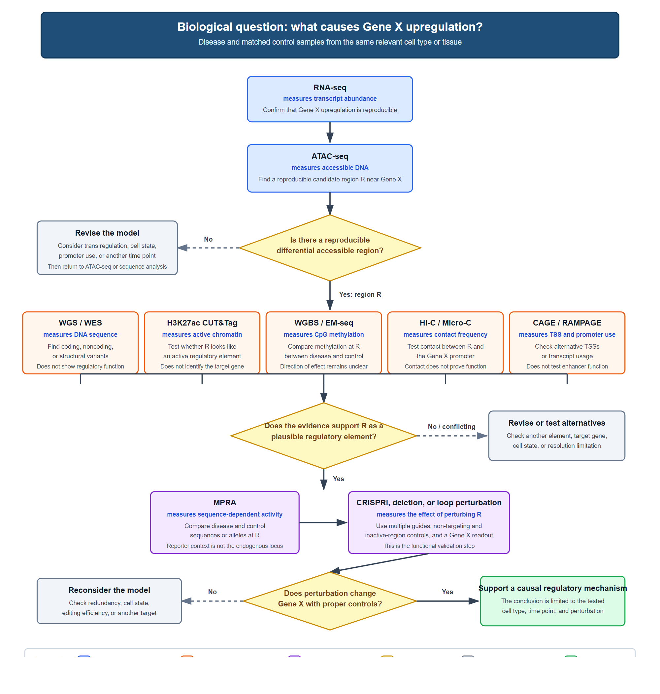
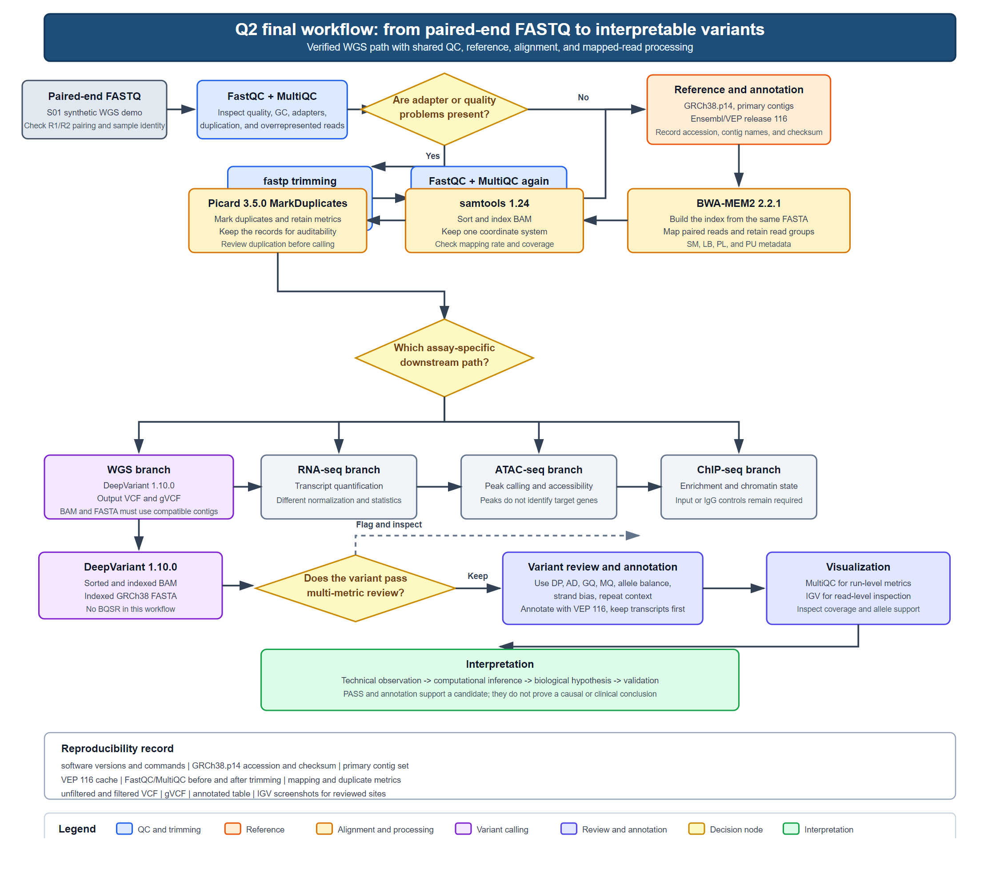
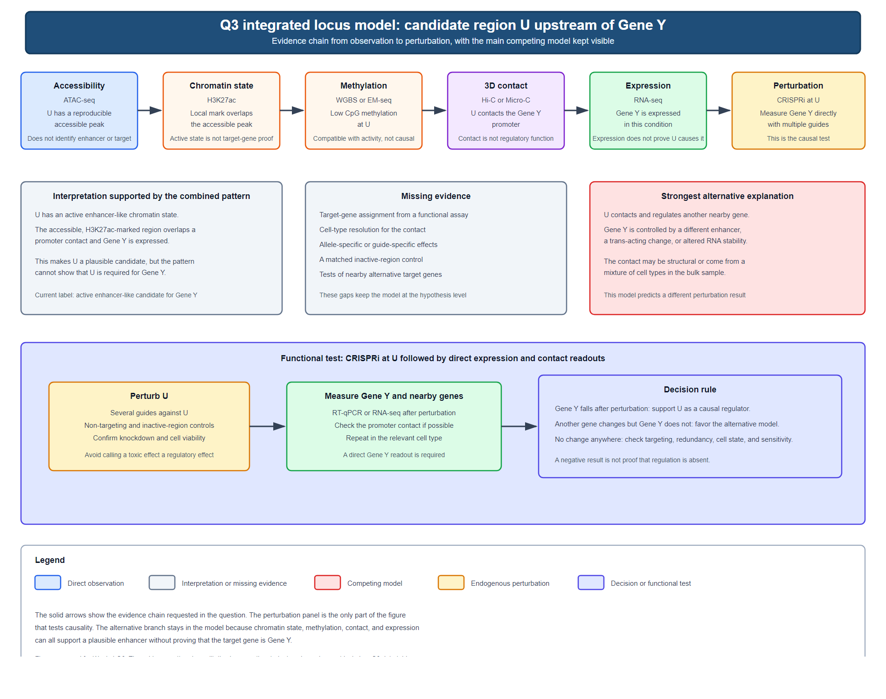
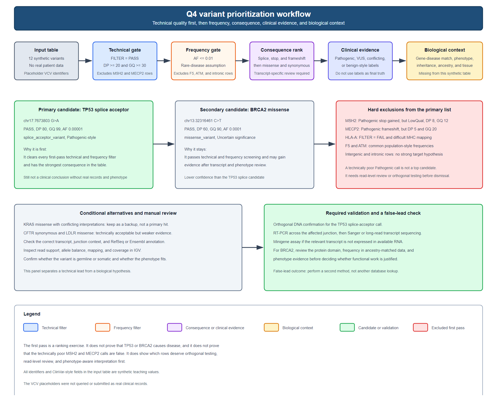

# Week 4 Homework Report

**Name:**  
**Student ID:**  
**Date:** 2026-09-19
**Course:** Bioinformatics: From Multi-Omics Data to Discovery

---

## Question 1 - Choose the Right Genomic Assay (25 pts)

### 1. Reasoning before AI

#### First assay: ATAC-seq

If I could start with one assay, I would choose ATAC-seq and compare the same disease-relevant cell type in cases and controls. ATAC-seq measures accessible DNA through Tn5 insertion. Differential peaks would give me a list of possible regulatory regions near Gene X, and motif enrichment could suggest transcription factors that might act there. Motif results would only be a hypothesis because ATAC-seq does not directly measure transcription-factor binding.

My main reason for starting with ATAC-seq is practical. Accessibility is one of the earlier regulatory features I can measure across the genome, and the result can help me decide which later assays are worth doing. RNA-seq tells me that Gene X is upregulated, but it does not tell me whether the cause is a DNA variant, a change in active chromatin, methylation, or a three-dimensional contact. ATAC-seq can narrow the search to specific regions for H3K27ac CUT&Tag or ChIP-seq, WGBS or EM-seq, Hi-C or Micro-C, and sequence analysis.

ATAC-seq also has clear limitations. An open region may be a promoter, enhancer, insulator, inactive element, or a region that regulates another gene. The assay cannot prove that a region is an enhancer, that it controls Gene X, or that accessibility causes the expression change. It also cannot tell me whether a DNA variant came first or whether the chromatin change happened later.

#### Proposed multi-stage strategy and decision rules

I would not follow the order below rigidly. WGS or WES data could be generated early, but I would interpret variants in candidate regions after ATAC-seq has identified those regions.

##### Stage 0. Check the expression result

I would first use RNA-seq from matched disease and control samples to check that Gene X upregulation is reproducible across biological replicates. I would also check whether a batch effect, a shift in cell composition, or a global change in expression could explain the result.

If the difference is not reproducible in the relevant cell type, I would revise the phenotype or sample model before testing regulatory mechanisms. If it is reproducible, I would keep the same sample set and move on to the regulatory assays.

##### Stage 1. Find candidate regulatory regions with ATAC-seq

I would run ATAC-seq in disease and control samples with biological replicates. After peak calling and differential accessibility analysis, I would focus on regions near the Gene X promoter and any upstream or downstream regions that stand out.

If a reproducible peak differs between disease and control samples near Gene X, I would define that region as R and carry it into Stage 2. If several peaks are present, I would rank them by effect size, reproducibility, distance from Gene X, and overlap with known regulatory annotations.

If accessibility does not change near Gene X, I would not conclude that no regulatory mechanism exists. I would test other explanations, including trans-acting regulators, changes in chromatin regulators, a different cell type or activation state, and changes in promoter or transcript usage. WGS/WES and CAGE/RAMPAGE could help revise the hypothesis.

##### Stage 2. Check the state of region R

I would use H3K27ac ChIP-seq or CUT&Tag to check whether R has an active enhancer-associated chromatin state. WGBS or EM-seq would measure methylation at R, and Hi-C or Micro-C would test whether R contacts the Gene X promoter. CAGE or RAMPAGE could be added if promoter or transcription-start-site usage may explain part of the expression difference.

If R is accessible and gains H3K27ac in disease samples, it becomes a stronger active-enhancer candidate. If it is accessible but lacks H3K27ac, I would lower its priority, but I would first check whether the relevant chromatin state or time point is missing.

If R is hypomethylated in disease samples, that is compatible with regulatory activity. If it is hypermethylated, I would consider a simple active-enhancer model less likely, although methylation can depend on cell context. If R contacts the Gene X promoter, a cis-regulatory model becomes more plausible. If no contact is detected, I would consider another target gene, an indirect mechanism, a cell-type-specific contact, or the resolution limits of the contact assay.

After these results, I would classify R as supported, uncertain, or contradicted and write down which evidence is still missing.

##### Stage 3. Check sequence variation

I would use WGS for noncoding and regulatory variants and WES for coding or exome-focused hypotheses. WES alone is not enough to rule out a noncoding regulatory variant. I would test whether variants in or near R track with accessibility, H3K27ac, methylation, contact, or Gene X expression and would look for allele-specific signals where possible.

If a cis-regulatory variant is present and its genotype tracks with the regulatory or expression change, I would prioritize that allele for functional testing. If no such variant is found, I would keep epigenetic and trans-regulatory hypotheses on the table. A missing variant is not proof of an epigenetic cause.

If a coding variant is found, I would consider whether altered Gene X protein function, feedback, or a trans-acting pathway could cause the expression change. If the evidence layers point in different directions, I would design the next experiment to separate the competing mechanisms instead of forcing one model to fit all the data.

##### Stage 4. Test regulatory activity and function

I would use MPRA to compare the regulatory activity of disease-associated and control alleles or sequences from R in a reporter assay. I would then use CRISPRi, enhancer deletion, or loop-anchor perturbation to test the endogenous element.

If the disease allele increases reporter activity in MPRA, it may act through an allele-specific regulatory mechanism, but the result does not prove that the endogenous element regulates Gene X. If CRISPR perturbation reduces Gene X expression compared with non-targeting and inactive-region controls, the result gives stronger support that the element or its contact is involved.

If MPRA is positive but CRISPR perturbation is negative, the reporter effect may not transfer to the endogenous chromatin context. If CRISPR perturbation is positive but MPRA is negative, the endogenous sequence context, chromatin, or three-dimensional organization may be needed for activity. If perturbation has no effect, I would consider redundant enhancers, the wrong cell type or state, another target gene, or a mechanism outside the tested element. I would not treat a negative result as proof that Gene X is unregulated.

#### Evidence hierarchy: observation, correlation, and causation

I will separate the results into three levels:

1. Direct observation: what the assay measures in the sampled cells.
2. Correlation or association: a measured feature changes with disease status or Gene X expression, but the direction and cause are unclear.
3. Causal evidence: a perturbation changes Gene X expression in the expected direction, with suitable controls and in the relevant biological context.

| Assay | Direct observation | Reasonable interpretation | Main limitation |
|---|---|---|---|
| RNA-seq | Transcript abundance and isoform usage | Gene X is differentially expressed or processed | It does not explain the cause |
| WGS / WES | DNA sequence and genotype | A variant may be related to the phenotype | A noncoding variant may not regulate Gene X |
| ATAC-seq | Accessible DNA and peak intensity | A region may be regulatory | It does not identify the enhancer, target gene, or cause |
| H3K27ac ChIP-seq / CUT&Tag | Enrichment of an active chromatin mark | A region may be actively regulated | It does not show which gene is controlled |
| WGBS / EM-seq | DNA methylation state | Methylation differs at the region | The difference may be a cause, a consequence, or a marker |
| Hi-C / Micro-C | Contact frequency | The region may contact the Gene X promoter | Contact does not prove function |
| CAGE / RAMPAGE | Promoter or transcription-start-site usage | Promoter or isoform usage differs | It does not explain why the change occurred |
| MPRA | Regulatory activity of a tested sequence | An allele or sequence changes reporter activity | The reporter may not represent the endogenous locus |
| CRISPR perturbation | Effect of editing an endogenous element | The element may be required for Gene X expression | Editing efficiency, controls, redundancy, and cell state affect the conclusion |

An open ATAC-seq peak is not automatically an enhancer. H3K27ac signal can mark active regulatory chromatin, but it does not show that the region controls Gene X. A methylation difference may appear after another regulatory change. A Hi-C or Micro-C contact shows proximity or contact frequency, but not that the contact has a regulatory function. A noncoding WGS or WES association still needs regulatory evidence. MPRA can test allele-dependent activity, but it does not reproduce all aspects of the endogenous chromatin or nuclear organization.

For CRISPRi, enhancer deletion, or loop-anchor perturbation, I would require a targeted perturbation, multiple guides or an independent perturbation when possible, non-targeting and inactive-region controls, the correct cell type and time point, and a readout that measures Gene X directly. Negative results also need careful interpretation because redundant enhancers, an inactive cell state, or incomplete editing can hide a real effect.

---

### 2. AI-assisted workflow

I used the following prompt after writing the plan in Section 1:

> Act as a skeptical genomics methods reviewer. Review my assay order, decision rules, and intended conclusions. Do not rewrite the plan for me. Identify missing controls, likely sources of confounding, conclusions that would be overinterpreted, necessary validation experiments, and any assay that should be moved earlier or later. For each issue, explain what result would change my decision.

The critique was useful because it challenged several assumptions that were easy to miss when the plan was written as a linear sequence. The main points are summarized below.

#### Missing controls

The first issue was that replicate samples alone are not enough. I need specific quality and control checks for each assay:

- ATAC-seq needs fragment-size checks, TSS enrichment, FRiP, mitochondrial read fraction, blacklist filtering, and concordance between biological replicates. It does not need an input-DNA control in the same way as ChIP-seq, so I should not simply copy the ChIP control scheme into the ATAC analysis.
- H3K27ac ChIP-seq or CUT&Tag needs input or IgG controls, antibody validation, replicate concordance, and a check for global changes in H3K27ac signal. A spike-in or an equivalent normalization strategy may be needed if the mark changes globally.
- WGBS or EM-seq needs conversion controls, coverage checks, and a way to distinguish a true methylation difference from incomplete conversion or low coverage.
- Hi-C or Micro-C needs checks for restriction-enzyme digestion, ligation efficiency, sequencing depth, and replicate reproducibility. A standard contact map may not have enough resolution to support a specific enhancer-promoter claim, so promoter-focused analysis may be necessary.
- WGS or WES needs sample-contamination checks, coverage summaries, sex checks, and ancestry or population-structure checks if allele frequencies are compared.
- MPRA needs positive and negative regulatory controls, multiple barcodes or replicate measurements, allele-swapped sequences, and controls for transfection and batch effects.
- CRISPRi, enhancer deletion, or loop-anchor perturbation needs non-targeting guides, an inactive or safe-harbor control region, multiple guides when possible, editing or knockdown efficiency measurements, cell-viability checks, and a Gene X-specific readout. A rescue experiment would make the causal claim stronger.

#### Confounding

The critique also pointed out that a difference between disease and control groups can come from something other than the proposed regulatory mechanism. Cell composition is a major concern. If the disease samples contain a different mixture of cell types, bulk RNA-seq, ATAC-seq, ChIP-seq, methylation, and Hi-C can all change without any cell-intrinsic regulatory change at Gene X. Cell sorting or single-cell measurements would help, but these are outside the methods listed for this question and would need to be treated as an additional design choice.

Other confounders include age, sex, medication, disease stage, tissue collection time, RNA quality, library batch, sequencing depth, and ancestry. I would match these variables at the design stage and include them in the analysis instead of assuming that matching is perfect.

The RNA-seq result could also have explanations that are not regulatory in the narrow sense. Copy-number changes, transcript stability, isoform usage, or a trans-acting pathway could increase Gene X RNA without changing the nearby chromatin in the expected direction. WGS, CAGE or RAMPAGE, and allele-specific expression analysis could help distinguish some of these possibilities. ATAC-seq and H3K27ac differences may also appear after transcription changes, so direction cannot be inferred from correlation alone.

#### Overinterpretation

The AI critique marked several conclusions as too strong for the proposed evidence:

- An ATAC-seq peak can nominate a regulatory region, but it does not show that the region is an enhancer or that it controls Gene X.
- H3K27ac enrichment can support an active chromatin state, but it does not identify the target gene or show that the mark causes expression.
- A methylation difference can be a cause, a consequence, or a marker. Without perturbation, the direction is unknown.
- A Hi-C or Micro-C contact can show proximity or contact frequency, but it does not prove that the contact regulates Gene X.
- A noncoding WGS or WES variant near R can be a candidate, but its annotation or association is not proof of function.
- A positive MPRA result applies to the tested sequence in a reporter system. It does not prove that the same sequence controls Gene X at the endogenous locus.
- A CRISPR perturbation result is stronger, but it can still be affected by incomplete editing, off-target effects, indirect effects, or redundancy. Appropriate controls and a direct readout are necessary.

#### Missing validation

The critique suggested several additions that were missing from the first version:

1. Check allele-specific expression in heterozygous samples when a candidate cis-regulatory variant is present.
2. Use CAGE or RAMPAGE if promoter choice or transcription-start-site usage could explain part of the expression difference.
3. Confirm that perturbation changes Gene X expression in the expected direction and that the effect is not caused by a general loss of cell fitness.
4. Use at least one independent perturbation method when possible. For example, if CRISPRi produces an effect, an enhancer deletion or loop-anchor perturbation would provide stronger support.
5. Add a rescue or allele-swap experiment when the goal is to connect a specific variant to Gene X expression.
6. Replicate the key finding in an independent biological sample set if the result is meant to support a general disease mechanism.

#### Assay order

The critique did not reject ATAC-seq as the discovery assay, but it suggested several changes to the original order:

- WGS or WES should be generated early because sample collection and sequencing take time, even if variant interpretation waits until R has been defined.
- H3K27ac, methylation, and contact assays should remain in the second stage because their value depends on having a candidate region.
- MPRA should not be automatic for every candidate. It makes the most sense when R contains a sequence variant or when the disease and control sequences differ in a way that can be tested.
- CRISPR perturbation should come after the candidate region and the expected causal mechanism are defined. Running it before that point would make it difficult to interpret a negative result.
- CAGE or RAMPAGE should move earlier if the RNA-seq data show a change in promoter or transcript usage.

#### Changes I will make after the critique

I would keep the general order of ATAC-seq discovery followed by mechanism-specific assays and functional testing, but I would add quality-control gates and make several decision points more explicit:

- Check cell composition and sample matching before interpreting any bulk regulatory assay.
- Treat ATAC-seq, H3K27ac, methylation, WGS/WES, and contact data as supporting evidence. A perturbation experiment is needed for a causal claim.
- Add allele-specific expression and, when possible, a second independent perturbation.
- Use negative results to revise the model instead of treating a single failed assay as proof that the mechanism is absent.
- Reserve the word "causal" for a perturbation experiment that changes Gene X expression with adequate controls.

These changes still need to be checked against assay documentation and primary sources. I will do that in Section 3 instead of accepting the AI critique as final.

---

### 3. Verification

I checked the AI critique against official consortium standards, platform documentation, and original method papers. The main conclusions are summarized below. The source numbers refer to the reference list at the end of this section.

| Assay | What it measures | Typical resolution | Input material | Main limitation | Best use in this question | Source |
|---|---|---|---|---|---|---|
| RNA-seq | RNA abundance and sequence | Gene-level quantification; isoform estimates are less reliable | Total RNA, usually with poly(A) selection or rRNA depletion | Expression is not a mechanism; library and analysis choices affect quantification | Confirm Gene X expression and detect promoter or isoform changes | [4] |
| WGS | DNA sequence across the genome | Base-pair variant resolution | Genomic DNA | Requires substantial sequencing and careful variant filtering; association is not function | Detect noncoding, structural, and copy-number changes | [6] |
| WES | DNA sequence in targeted coding regions | Base-pair variant resolution within captured regions | Genomic DNA plus exome capture | Misses most noncoding regulatory sequence | Test coding or exome-focused hypotheses | [7] |
| ATAC-seq | Accessible DNA | Read ends are base-pair level; peaks are usually hundreds of base pairs, with nucleosome information from fragment size | Nuclei or cells, with lower input than many ChIP assays | Open chromatin does not identify the enhancer, target gene, transcription factor, or cause | Find candidate regulatory regions near Gene X | [1] |
| H3K27ac ChIP-seq | Enrichment of the H3K27ac histone mark | Usually hundreds of base pairs to broader domains, depending on the mark and analysis | Chromatin, validated antibody, and input or IgG control | Mark enrichment does not prove target-gene regulation | Test for active enhancer-associated chromatin | [2] |
| CUT&Tag and CUT&RUN | Protein-DNA binding or histone-mark enrichment | Similar target resolution to ChIP-seq, with high signal-to-noise and low input | Cells or nuclei, antibody or fusion protein, and controls | Lower input does not remove antibody, epitope, or normalization concerns | Use when material is limited or a lower-background profile is needed | [2][9][10] |
| WGBS | DNA methylation at CpG sites | Single-base CpG resolution | Genomic DNA; bisulfite conversion degrades DNA | Low coverage, incomplete conversion, or cell mixtures can create false differences | Measure methylation at region R | [3] |
| EM-seq | DNA methylation at CpG sites | Single-base CpG resolution | Genomic DNA converted enzymatically instead of by bisulfite | Still coverage dependent, and the same causal limitations apply | Measure methylation when DNA input or degradation is a concern | [8] |
| CAGE and RAMPAGE | 5' ends of capped RNA and transcription start sites | Base-pair TSS resolution | RNA, usually poly(A)+ or rRNA-depleted material; ENCODE expects 20 million aligned reads per replicate and a matching RNA-seq control | Measures promoter or TSS usage; it does not measure enhancer activity or causality | Test promoter choice, alternative TSSs, or transcript usage | [5] |
| Hi-C | Contact frequency between genomic regions | Often kilobase to megabase scale, depending on depth and library | Intact nuclei or cells, crosslinking, restriction digestion, ligation, and deep sequencing | Contact is not function; resolution and cell composition can limit interpretation | Test whether region R contacts the Gene X promoter | [11][12] |
| Micro-C | Contact frequency with higher resolution than standard Hi-C | Higher-resolution contact maps, with nucleosome-scale information in suitable systems | Similar starting material and library workflow, often with deep sequencing | Higher resolution does not by itself prove regulatory causality | Resolve contacts that are unclear in standard Hi-C | [12] |
| MPRA | Regulatory activity of a tested DNA sequence | One measurement per tested element or allele | A synthesized reporter library, suitable cells, and internal controls | The reporter context does not reproduce all endogenous chromatin or nuclear organization | Compare disease and control alleles from region R | [13] |
| CRISPRi or CRISPR perturbation | Expression change after targeted perturbation | Guide-level targeting; effective region can range from a local regulatory element to a larger deletion | Cells that can be edited or repressed, delivery system, controls, and efficiency measurements | Off-target effects, incomplete perturbation, cell fitness, and enhancer redundancy can affect the result | Test whether region R or its contact is required for Gene X expression | [14][15] |

The ENCODE standards also changed two details in my original plan. ATAC-seq requires biological replicates and reports TSS enrichment, FRiP, read depth, fragment-length features, and replicate concordance; it does not use an input-DNA control in the way ChIP-seq does [1]. For histone ChIP-seq, ENCODE expects antibody characterization, an input or IgG control with matched run type and replication structure, and different sequencing depths for narrow and broad marks [2]. H3K27ac is treated as a broad histone mark in the ENCODE standard, so I should not use a narrow-peak depth assumption for it.

The methylation standards supported the AI's concern about conversion and coverage. ENCODE recommends 30X coverage per replicate for WGBS, a minimum read length of 100 bp, and a conversion rate of at least 98% [3]. EM-seq uses enzymatic conversion and can work from lower amounts of DNA, but coverage and cell-composition issues remain [8].

The RNA and promoter assays changed how I would interpret the final expression result. Bulk RNA-seq gives reasonably reliable gene-level quantification, while isoform estimates are more dependent on the analysis pipeline [4]. CAGE and RAMPAGE give base-pair information about transcription start sites, but they do not replace RNA-seq or prove that an enhancer is causal [5].

For contact assays, the 4D Nucleome portal describes Hi-C data as maps of 3D genome organization [11]. Micro-C improves contact-map resolution, but the original mammalian study also makes clear that the interpretation depends on the experimental system and resolution [12]. The AI's suggestion to use promoter-focused analysis is therefore reasonable when the question is about one enhancer-promoter pair. Standard Hi-C may not have enough resolution or depth to answer that question by itself.

The MPRA literature supports testing sequence-dependent regulatory activity, not endogenous target-gene regulation [13]. The same limitation applies to allele-swapped reporter libraries. CRISPRi and related perturbations give stronger causal evidence because they act on an endogenous locus, but the original CRISPRi studies still require efficient targeting and careful controls [14][15].

#### AI suggestions I accepted

- I accepted the assay-specific quality-control requests for ATAC-seq, ChIP-seq or CUT&Tag, WGBS or EM-seq, Hi-C or Micro-C, MPRA, and CRISPR. The ENCODE standards and original method papers support the need for replication, assay quality metrics, controls, and reproducibility checks.
- I accepted that WGS or WES can be generated early, but their interpretation should wait until ATAC-seq or another discovery assay has identified candidate regions.
- I accepted that cell composition, sample matching, batch effects, and tissue quality are major confounders for every bulk assay.
- I accepted that H3K27ac, methylation, contact, and sequence evidence are supporting observations. A perturbation experiment is needed if I want to use the word "causal."
- I accepted the suggestion to run CAGE or RAMPAGE earlier when the RNA-seq data suggest a promoter or transcript-usage change.
- I accepted the suggestion to use MPRA only when there is a testable sequence or allele hypothesis. Running it by default would not answer the epigenetic part of the question.

#### AI suggestions I accepted with qualifications

- Spike-in or equivalent normalization can be useful for H3K27ac when global changes are plausible, but it is not required in every ChIP-seq experiment. ENCODE requires input or IgG controls and antibody characterization; spike-in can be useful, but it is not the only valid normalization method.
- Promoter-focused Hi-C or Micro-C analysis can help with a specific enhancer-promoter question, but it does not prove function. A contact result still needs perturbation.
- WGS population-structure checks matter when allele frequencies or genotype-phenotype associations are compared. They are less relevant if the analysis is limited to a known candidate variant, although ancestry can still affect frequency interpretation.
- Rescue or allele-swap experiments make a causal claim stronger, but they are not always feasible in the available cell model. They are an additional level of evidence when feasible, not an absolute requirement.
- Independent sample replication is scientifically useful, but the assignment does not provide a second real cohort. It should be listed as a limitation or future validation step, not invented as part of the data.

#### AI suggestions I rejected or corrected

- I rejected the idea that ATAC-seq needs the same input-DNA control scheme as ChIP-seq. ENCODE's ATAC-seq standard uses replicate and signal-quality metrics instead [1].
- I rejected the idea that every candidate region must go through MPRA. MPRA is most useful for sequence or allele comparisons, and it cannot replace an endogenous perturbation [13].
- I rejected the idea that one CRISPR guide is enough to establish causality. Multiple guides when possible, targeting efficiency, viability controls, and a direct Gene X readout are needed [14].
- I rejected the idea that a WGS or WES association, an active chromatin mark, a methylation difference, or a 3D contact can by itself prove that region R regulates Gene X.
- I corrected the original order so that WGS or WES data can be generated early, but variants are prioritized only after a candidate region exists.
- I rejected the interpretation that a negative perturbation result rules out the mechanism. Redundant enhancers, incomplete editing, the wrong cell state, or insufficient assay sensitivity can all produce a negative result.

#### References

1. ENCODE. "ATAC-seq Data Standards and Processing Pipeline (ENCODE4)." https://www.encodeproject.org/data-standards/atac-seq/atac-encode4/ (accessed 2026-09-19).
2. ENCODE. "Histone ChIP-seq Data Standards and Processing Pipeline (ENCODE 4)." https://www.encodeproject.org/chip-seq/histone-encode4/ (accessed 2026-09-19).
3. ENCODE. "Whole-Genome Bisulfite Sequencing Data Standards and gemBS-based Processing Pipeline." https://www.encodeproject.org/data-standards/wgbs-encode4/ (accessed 2026-09-19).
4. ENCODE. "Bulk RNA-seq Data Standards and Processing Pipeline." https://www.encodeproject.org/data-standards/encode4-bulk-rna/ (accessed 2026-09-19).
5. ENCODE. "RAMPAGE and CAGE Data Standards and Processing Pipeline." https://www.encodeproject.org/data-standards/rampage/ (accessed 2026-09-19).
6. Illumina. "Whole-Genome Sequencing (WGS)." https://www.illumina.com/techniques/sequencing/dna-sequencing/whole-genome-sequencing.html (accessed 2026-09-19).
7. Illumina. "Whole Exome Sequencing." https://www.illumina.com/techniques/sequencing/dna-sequencing/targeted-resequencing/exome-sequencing.html (accessed 2026-09-19).
8. Vaisvila, R., et al. "Enzymatic methyl sequencing detects DNA methylation at single-base resolution from picograms of DNA." Genome Research 31, 1280-1289 (2021). https://doi.org/10.1101/gr.266551.120.
9. Kaya-Okur, H. S., et al. "CUT&Tag for efficient epigenomic profiling of small samples and single cells." Nature Communications 10, 1930 (2019). https://doi.org/10.1038/s41467-019-09982-5.
10. Skene, P. J., and Henikoff, S. "An efficient targeted nuclease strategy for high-resolution mapping of DNA binding sites." eLife 6, e21856 (2017). https://doi.org/10.7554/eLife.21856.
11. 4D Nucleome Program. "Understand 4D DNA Organization" and 4DN Data Portal. https://www.4dnucleome.org/ and https://data.4dnucleome.org/ (accessed 2026-09-19).
12. Krietenstein, N., et al. "Ultrastructural Details of Mammalian Chromosome Architecture." Molecular Cell 78, 554-565.e7 (2020). https://doi.org/10.1016/j.molcel.2020.03.003.
13. Kheradpour, P., et al. "Systematic dissection of regulatory motifs in 2000 predicted human enhancers using a massively parallel reporter assay." Genome Research 23, 800-811 (2013). https://doi.org/10.1101/gr.144899.112.
14. Qi, L. S., et al. "Repurposing CRISPR as an RNA-guided platform for sequence-specific control of gene expression." Cell 152, 1173-1183 (2013). https://doi.org/10.1016/j.cell.2013.02.022.
15. Gilbert, L. A., et al. "CRISPR-mediated modular RNA-guided regulation of transcription in eukaryotes." Cell 154, 442-451 (2013). https://doi.org/10.1016/j.cell.2013.06.044.

---

### 4. Final conclusion



**Workflow figure:** `figures/Q1_workflow.png`  
**Vector source:** `figures/Q1_workflow.svg`

**Approximately 200-word explanation:**

I would confirm the RNA-seq result, then compare disease and control chromatin with ATAC-seq. RNA-seq shows that Gene X is upregulated but not why. ATAC-seq nominates candidate regions and helps order the next assays. WGS or WES tests nearby DNA variants; H3K27ac CUT&Tag tests active chromatin; WGBS or EM-seq tests methylation; Hi-C or Micro-C tests contact; CAGE or RAMPAGE tests promoter and TSS use.

None proves causality alone. An ATAC peak may be inactive. A variant near R can be present without causing the expression change. WGS and WES describe sequence, not function. H3K27ac, methylation, and contact can track expression, but they do not show which change came first. A contact can also exist without controlling Gene X. MPRA tests sequence activity only in a reporter, and CAGE or RAMPAGE do not test enhancer function.

These assays complement one another. ATAC-seq finds R; sequence and chromatin data test whether R fits the mechanism; contact and promoter data connect R to Gene X. MPRA tests allele activity, while CRISPRi, deletion, or loop perturbation tests whether R is required for Gene X expression. I would call the mechanism causal only when a controlled perturbation changes Gene X in the expected direction.

> The biological question chooses the assay because the hypothesis determines whether I need to discover a region, test a regulatory layer, or prove that an element changes Gene X expression.

---

## Question 2 - From FASTQ to a Trustworthy Analysis Workflow (25 pts)

### 1. Reasoning before AI

#### Initial workflow sketch

My first workflow is:

```text
Raw paired-end FASTQ
  -> FASTQ quality control
  -> adapter and quality trimming, followed by a second QC check
  -> reference genome and annotation selection
  -> alignment
  -> mapped-read processing
  -> WGS variant calling and filtering
  -> variant annotation
  -> visualization and manual inspection
  -> biological interpretation and validation planning
```

The exact reference release, aligner version, and filtering thresholds still need to be checked. At this stage, I am only defining the logical order of the analysis and the decisions that depend on earlier results.

#### Purpose of each step

| Step | What I would do | Main output | Why the step matters |
|---|---|---|---|
| 1. FASTQ QC | Run FastQC and combine reports with MultiQC | QC report before trimming | Detects low-quality bases, adapters, contamination signals, and duplicate patterns before they affect alignment |
| 2. Reference selection | Choose a named human genome build and matching annotation | Reference FASTA, index, and annotation files | All coordinates and downstream annotations must refer to the same genome version |
| 3. Alignment | Map paired-end reads to the selected reference | Sorted BAM or CRAM | Converts reads into genomic positions that can be processed and counted |
| 4. Mapped-read processing | Sort, index, mark duplicates, and record read-group or sample information | Analysis-ready BAM or CRAM | Reduces avoidable technical effects and prepares the file for variant calling |
| 5. WGS downstream analysis | Call variants and apply quality-aware filtering | VCF before annotation | Turns aligned reads into candidate variants, but does not yet explain their biology |
| 6. Annotation | Add gene, transcript, consequence, frequency, and database evidence | Annotated VCF or variant table | Places variants in a biological context and helps separate technical calls from plausible candidates |
| 7. Visualization | Inspect coverage and candidate variants in a genome browser, and summarize QC in plots | IGV views and summary figures | Makes unusual coverage, mapping, or variant patterns easier to notice |
| 8. Interpretation | Combine QC, variant quality, annotation, frequency, and biological context | Candidate list and next experimental step | Keeps the conclusion at the level supported by the data |

Steps 1 to 4 can be shared across WGS, RNA-seq, ATAC-seq, and ChIP-seq, although the exact QC thresholds and trimming choices may differ. After processing, the workflow branches. For WGS, I would continue to variant calling. For RNA-seq, I would quantify expression. For ATAC-seq, I would call accessible regions. For H3K27ac ChIP-seq, I would call enrichment regions and inspect the active chromatin signal.

#### Decision rules before AI

- If the first QC run shows adapter contamination, I would trim adapters and run QC again. I would not ignore the adapter result just because the reads can still be aligned.
- If per-base quality drops near the 3' end, I would use moderate quality trimming and check how many bases are removed. Aggressive trimming could shorten reads enough to reduce mapping quality.
- If the GC distribution has a high-GC shoulder or a second peak, I would investigate contamination, library bias, or a mixed sample. I would not delete all high-GC reads without understanding the pattern.
- If duplication is high, I would keep the reads in the file and mark the duplicates. Some duplicated reads can still carry valid information for coverage and variant calling.
- If the mapping rate is lower than expected, I would check the reference build, adapter leftovers, contamination, read length, and trimming choices before changing the aligner.
- If coverage is uneven or a variant has low depth, I would not trust the call simply because it appears in a VCF. I would inspect the read evidence and apply filtering that reflects the sample and assay.
- If a variant is rare and has a plausible functional consequence, I would still treat it as a candidate until database evidence and biological context support it.

#### FastQC metrics I would inspect

The synthetic snapshot contains several planted problems. I would interpret at least these five metrics before asking AI for help.

| Metric | Observation in the demo | My interpretation | Preliminary decision |
|---|---|---|---|
| Per base sequence quality | R1 falls to a Phred score around 12 after cycle 50 for roughly 15% of reads | This is a clear 3' quality problem and could create mismatches or reduce mapping quality | Apply moderate 3' trimming and run QC again |
| Per sequence GC content | Main mode is about 41% GC, with a high-GC shoulder near 78% | The shoulder suggests contamination, a GC-biased fraction, or a mixed library; the cause is not clear from FastQC alone | Investigate read composition and contamination before removing reads |
| Adapter content | The Illumina-like sequence `AGATCGGAAGAGC` rises at the 3' end in about 15% of pairs | Adapter read-through has occurred and should not be carried into alignment | Perform adapter trimming and repeat QC |
| Sequence duplication levels | One template appears in roughly 15% of R1 reads | The library may have low complexity or PCR duplicates | Mark duplicates and examine library complexity; do not simply delete all duplicated reads |
| Overrepresented sequences | A fragment matching the adapter appears among the top sequences | This agrees with the adapter-content result and does not add a separate biological signal | Use the adapter result to guide trimming and then re-check the metric |

The per-base N content and sequence length modules look normal in the snapshot, so they do not require a major intervention in this demo.

#### Initial choices that still need verification

I would begin with human GRCh38, but I would not write "GRCh38" without a specific release and annotation source. The reference choice needs to match the aligner, variant caller, annotation database, and any later comparison with public data.

For the initial plan, I would consider a short-read aligner such as BWA-MEM2, duplicate marking with Picard or GATK, variant calling with GATK HaplotypeCaller or DeepVariant, and annotation with VEP, ANNOVAR, or SnpEff. These are placeholders. Their versions, output formats, required indexes, and key parameters need to be checked against official documentation before they are presented as final decisions.

I would also record the sample name, library, platform, lane, and read group during alignment. Without this metadata, later files may be difficult to reproduce or combine correctly.

At the end of this section, I still have several questions for the AI-assisted workflow: which reference release is most appropriate, whether base quality recalibration is needed with the selected caller, how filtering should change with coverage, and which QC results should stop the analysis or lead to a rerun.

---

### 2. AI-assisted workflow

I used a plan-first prompt because a long list of commands would make it harder to see whether the logic of the workflow was sound. The first prompt asked for a review and an ordered plan. It did not ask for version-specific parameters.

> Act as a senior genomics workflow reviewer. I assume paired-end human WGS reads. Review my eight-step workflow and preliminary tool choices. For each step, give the purpose, input, output, likely failure modes, and a rule for moving forward, rerunning, or stopping. Point out missing quality checks, incorrect ordering, and assumptions that need verification. Return a plan only. Do not write shell commands until I approve the plan.

After reviewing the plan, I used a second prompt for the implementation details:

> Expand the approved plan into the tool families and command names that would be used at each step. Mark every parameter or threshold that depends on the software version, reference release, coverage, or sample design. Do not present a placeholder value as a final recommendation.

#### AI review of the workflow

The AI kept the overall order from my first plan, but it made the decision points more explicit. The revised order is:

```text
Raw paired-end FASTQ
  -> FASTQ QC and read-pair checks
  -> decide whether trimming is needed
  -> choose the reference and annotation, and build matching indexes
  -> align reads with read-group metadata
  -> sort, index, and mark duplicates
  -> inspect mapping and duplication metrics
  -> call variants
  -> filter calls using quality and context
  -> annotate variants
  -> visualize and manually inspect selected sites
  -> interpret with a clear distinction between evidence and hypothesis
```

The AI treated reference selection as something that can happen while QC is running. I agree with that arrangement because the reference choice does not depend on the QC result. Alignment must wait until the reference files and indexes exist.

| Step | AI recommendation | My provisional response |
|---|---|---|
| FASTQ QC | Run FastQC before and after trimming. Check that R1 and R2 are valid pairs and that read groups match the sample sheet. | Accept. Add a failed-pair check and sample identity check to the plan. |
| Trimming | Trim adapters when adapter content is high. Use quality trimming only where the quality profile supports it. | Accept with a caution. I would compare trimmed and untrimmed QC instead of assuming that trimming always improves mapping. |
| Reference | Use a named human GRCh38 release and a matching annotation source. Record the contig set and index version. | Accept in principle. I cannot decide the exact release until I check the reference documentation. |
| Alignment | Use a short-read aligner such as BWA-MEM2 and include sample, library, platform, lane, and read-group metadata. | Keep as a candidate. The aligner and exact command need version checks. |
| Mapped-read processing | Sort and index the alignment, then mark duplicates. Keep duplicate metrics for review. | Accept. I would not delete duplicated reads at this point. |
| BQSR | Run BQSR before variant calling when the selected caller expects recalibrated base qualities. | Modify. BQSR should be conditional on the caller and reference resources, not a default step for every pipeline. |
| Variant calling | Use a WGS-appropriate caller such as GATK HaplotypeCaller or DeepVariant. Use joint calling only when the study design and sample set support it. | Hold for verification. I would not choose the caller until I check the caller documentation and data requirements. |
| Variant filtering | Filter on depth, genotype quality, allele balance, strand bias, mapping quality, repetitive regions, and other caller-specific metrics. | Accept the logic, reject fixed thresholds at this stage. Thresholds need to match coverage, caller, and the intended analysis. |
| Annotation | Annotate with VEP, ANNOVAR, or SnpEff using a recorded transcript set and database version. | Accept. The database and transcript versions must be written in the report. |
| Visualization | Use MultiQC for run-level summaries and IGV or a comparable browser for site-level inspection. | Accept. Visualization supports both QC and site review, so it belongs before the final report. |
| Interpretation | Separate technical observations, computational inference, biological hypotheses, and required validation. | Accept. I would not call a variant causal from annotation or frequency alone. |

#### Main changes suggested by the AI

The review made failure paths more explicit. A failed QC result should lead to one of three actions: trim and rerun, investigate the sample or library, or stop the analysis. It should not automatically lead to more trimming.

Reference preparation was moved ahead of alignment. The reference release, annotation source, and index must be compatible. If one of these files changes after alignment, the alignment and downstream files should be regenerated.

Duplicate handling also changed. For WGS, the plan will mark duplicates and keep the Picard or GATK duplicate metrics for review. Deleting all duplicate reads would remove information that may still be useful for coverage checks.

The review also discouraged one universal filtering rule. A variant that passes depth and genotype-quality filters can still be a poor candidate because of strand bias, low mapping quality, repeat context, or a database mismatch. The final filter needs to be justified after the caller and coverage are known.

The last major change was to make the assay-specific branch more visible. The common pipeline can start with FASTQ QC and mapped-read processing, but WGS, RNA-seq, ATAC-seq, and H3K27ac ChIP-seq cannot share the same downstream analysis. WGS continues to variant calling. RNA-seq continues to transcript quantification. ATAC-seq and ChIP-seq continue to peak calling and regulatory interpretation.

#### AI suggestions I did not accept as written

- A fixed minimum depth or genotype-quality cutoff stays out of the plan until the caller and expected coverage are known.
- BQSR remains conditional. Some callers use different preprocessing recommendations, so this choice belongs to the software-specific verification stage.
- Duplicate reads will be marked and inspected. The plan will not delete them all.
- The filter will not use one recipe for every WGS sample. Coverage and library quality can differ between samples.
- Exact command parameters remain undecided until the reference release, tool version, and file format are checked.

#### Questions to carry into verification

The AI-assisted plan leaves several points open:

1. Which GRCh38 release and contig set should be used, and which annotation release matches it?
2. Which aligner version and read-group fields are required by the chosen downstream pipeline?
3. Does the selected variant caller require BQSR, or does it use a different preprocessing model?
4. Which filtering metrics should be kept separate from hard filters so that they can be inspected later?
5. Which annotation database and transcript version should be recorded?
6. Which of the proposed commands are still current, and which have been replaced or renamed?

These questions belong to Section 3. I will not treat the AI plan as final until the reference, file formats, software versions, and major parameters have been checked against official documentation.

---

### 3. Verification

I checked the plan against primary documentation instead of tutorials. I used NCBI for the assembly, the SAM/BAM and VCF specifications for file structure, and the official documentation or source repositories for BWA-MEM2, Picard, DeepVariant, VEP, fastp, FastQC, samtools, and GATK. The FASTQ demo is synthetic and much smaller than a real WGS library, so I did not invent mapping rates, coverage, or variant results.

#### Reference and annotation

I will use human GRCh38.p14. NCBI identifies this assembly as RefSeq accession `GCF_000001405.40` and GenBank accession `GCA_000001405.29` [1]. "GRCh38" by itself is not specific enough because the patch version and file source affect the contig set and sequence names. For this teaching workflow, I will use the primary assembly, exclude ALT and decoy contigs, and keep one FASTA as the only reference used for indexing, alignment, and variant calling.

For annotation, I will use Ensembl release 116 and the matching VEP release 116 cache. VEP uses GRCh38 by default when `--grch37` is not selected [9], but the cache is release-specific. The cache release, transcript source, and contig naming have to match the VCF. I would not mix `1`, `chr1`, and `NC_000001.11` names in one run. The AI originally wrote only "use GRCh38", so I changed this to one named patch, one accession, one contig set, and one annotation release.

#### FASTQ QC and trimming

The FastQC snapshot is synthetic, so the warnings describe planted problems. They do not indicate a failed sequencing run. The official FastQC adapter module supports the decision to trim adapters when adapter sequence accumulates at the 3' end [10]. The GC module says a broad peak or shoulder may reflect contamination or another biased subset, and it should be interpreted together with overrepresented sequences [11]. I therefore kept the plan to investigate the high-GC shoulder and did not delete all high-GC reads.

The AI's first trimming suggestion was effectively "trim adapters, then rerun QC". That was incomplete for paired-end fastp data. The official fastp documentation states that adapter auto-detection is disabled for paired-end input by default. It has to be enabled with `--detect_adapter_for_pe`, or the adapter sequences have to be supplied explicitly [12]. The demo contains an `AGATCGGAAGAGC` fragment, which is consistent with the TruSeq adapter family. My final QC branch is:

```text
FastQC/MultiQC before trimming
  -> trim with fastp using paired-end adapter detection or explicit adapter sequences
  -> use moderate 3' quality trimming only where the quality profile supports it
  -> run FastQC/MultiQC again
  -> compare read count, length, GC, duplication, and adapter metrics before moving on
```

I would not use a fixed "trim the last N bases" rule. The quality profile, read length after trimming, and mapping metrics determine whether the trimming helped.

#### Alignment and mapped-read processing

I will use BWA-MEM2 version 2.2.1. Its official documentation shows that the FASTA must first be indexed with `bwa-mem2 index`, and that `bwa-mem2 mem` maps paired reads and writes SAM output [4]. The index has to be built from the same FASTA that is later supplied to the caller.

The alignment command needs read-group metadata. The SAM specification says each `@RG` line must have a unique `ID`, and every alignment record carrying an `RG` tag must have a matching header line [2]. I will include at least:

```text
ID = unique read-group ID
SM = sample name
LB = library
PL = ILLUMINA
PU = platform unit, such as flowcell-barcode.lane
```

Without those fields, later sample or lane information can be lost. This was an addition to the AI plan, not a rejection of it.

After alignment, I will sort the file by coordinate and create an index. The SAM header records coordinate sorting with `SO:coordinate`, and the VCF specification likewise expects a defined and stable reference context for downstream files [2][3]. For the teaching workflow I will keep BAM because it is the format used in the DeepVariant quick start [6]. CRAM would be reasonable for long-term storage, but introducing it would add reference-encoding details that are not needed for this assignment.

Duplicate handling will use Picard 3.5.0 MarkDuplicates. The official tool description says that it finds reads from a single DNA fragment, marks them with SAM flag `0x400`, and writes a metrics file [5]. I will keep the records and retain the metrics. This is different from deleting every duplicated read. Marking preserves coverage information and makes the duplicate rate visible.

#### Variant calling and BQSR

I changed the main caller from a general GATK HaplotypeCaller plan to DeepVariant 1.10.0 for this workflow. The official DeepVariant documentation states that the reference FASTA and BAM must both be indexed, the BAM must be coordinate sorted, and the BAM and FASTA have to contain compatible contigs [7]. The quick start gives a WGS model and produces both `VCF.gz` and `gVCF.gz` outputs with tabix indexes [6].

DeepVariant's own documentation recommends against BQSR and reports a small decrease in accuracy when BQSR is performed [7]. This is direct evidence against the AI recommendation to run BQSR before calling. I therefore removed BQSR from the final WGS branch. BQSR is not wrong in every pipeline. It depends on the caller and available known sites. It is simply not appropriate for the caller selected here.

Duplicate marking is also not treated as mandatory. DeepVariant says that duplicate marking may be performed and that the accuracy difference is small, with the effect mainly appearing below 20x coverage [7]. Its `make_examples` code excludes duplicate reads by default through `keep_duplicates=False` [8]. I will still mark duplicates because this gives a library-complexity metric and makes the decision explicit. The duplicates stay in the BAM for auditability.

For the demo itself, no biological variant interpretation will be attempted. The file contains only 120 synthetic pairs, which is nowhere near enough coverage for a genome-wide call set. If a small test call is run, it is a software check only.

#### Variant filtering

There is no universal depth or genotype-quality cutoff that can be copied into every WGS project. GATK's hard-filtering guidance presents example thresholds for selected variant metrics and warns that they have to be adapted to the dataset [14]. I will use the following properties to review the evidence. They are not fixed biological cutoffs:

| Field or pattern | What it helps check | How I will use it |
|---|---|---|
| `QUAL` | Caller confidence in the variant | Compare with coverage and genotype evidence; do not use one cutoff for all regions |
| `DP` and `AD` | Total and allele-specific depth | Check whether the genotype has enough support and whether one allele is barely covered |
| `GQ` | Confidence in the assigned genotype | Use as one piece of evidence, not as proof that the variant is real |
| Allele balance | Whether a heterozygous call has balanced read support | Inspect outliers, but allow for mapping and sequencing bias |
| `MQ` | Mapping confidence around the call | Inspect low values and repeat or paralogous regions |
| `QD`, `FS`, `SOR`, `ReadPosRankSum`, `MQRankSum` | Possible strand, position, or mapping artifacts | Use the caller-appropriate thresholds as review filters and compare with IGV |
| Repeat and segmental-duplication annotations | Ambiguous or duplicated reference sequence | Flag separately from high-confidence regions |

SNPs and indels will not share one threshold table. Indel calls often have lower depth or quality than nearby SNPs without being false. I will also keep the original callset before filtering, write down every filter, and inspect candidate sites in IGV. A `PASS` label means that a record passed the caller's or filterer's checks. It does not mean that the variant is biologically causal or clinically actionable.

#### Annotation

I will annotate with Ensembl VEP release 116 in cache and offline mode, using the GRCh38 cache and VCF input [9]. The command will record the VEP version, cache release, transcript source, and any `--pick` or transcript-selection option. I will keep multiple transcript consequences during the first annotation pass and only shorten the output after checking which transcripts are relevant. AI suggested using `--pick` immediately to make the table simpler. I rejected that as the default because it can hide alternative transcripts, including a more relevant consequence.

VEP consequences are predictions based on a transcript model. A `missense_variant` or `splice_region_variant` label does not by itself establish disease relevance. Frequency databases, clinical evidence, transcript expression, and experimental validation remain separate evidence layers.

#### Visualization and reproducibility

MultiQC will combine FastQC reports and can also summarize alignment and duplicate metrics. IGV will be used for read-level inspection of selected sites, coverage gaps, allele balance, and suspicious mapping. `samtools 1.24` will provide sorting, indexing, and basic alignment statistics [13].

The final run record should contain:

```text
software_versions.txt
commands.sh or workflow configuration
reference FASTA name, accession, and checksum
annotation cache release and checksum
sample sheet and read-group table
FastQC/MultiQC reports before and after trimming
mapping and duplicate metrics
unfiltered and filtered VCF files
annotated variant table
IGV screenshots for manually reviewed candidates
```

These files make it possible to see where a result came from. A workflow in a report is not reproducible if the reference release, annotation cache, software version, or filter logic is missing.

#### AI-audit table

| AI recommendation | My verification | Final decision |
|---|---|---|
| Treat "GRCh38" as a complete reference description | NCBI distinguishes GRCh38.p14 as `GCF_000001405.40` and `GCA_000001405.29` [1] | Changed. Use one named patch, accession, contig set, and source file |
| Use any current annotation database | VEP caches and transcript annotations are release-specific, and VEP uses GRCh38 unless `--grch37` is selected [9] | Changed. Pair the reference with Ensembl/VEP release 116 and record the cache version |
| Run default paired-end adapter trimming | fastp disables paired-end adapter auto-detection by default [12] | Modified. Use `--detect_adapter_for_pe` or explicit R1/R2 adapter sequences |
| Trim the last N bases from every read | The FastQC profile, post-trim length, and mapping metrics decide whether trimming helps | Rejected as a fixed rule. Use moderate quality trimming and compare pre/post QC |
| Remove all duplicate reads before calling | Picard marks duplicates and reports metrics [5]; DeepVariant ignores duplicates by default but can accept an unmarked BAM [7][8] | Modified. Mark duplicates, keep the records, and retain the metrics |
| Run BQSR before variant calling | DeepVariant 1.10.0 recommends against BQSR and reports a small accuracy decrease [7] | Rejected for this pipeline. Remove BQSR from the WGS branch |
| Use GATK HaplotypeCaller as the main caller | DeepVariant documents a supported WGS model and the required sorted/indexed BAM plus indexed FASTA [6][7] | Changed. Use DeepVariant 1.10.0 for this workflow; GATK remains an alternative, not a second mandatory pass |
| Apply one fixed `DP` or `GQ` cutoff to every sample | No single threshold covers all coverage, ploidy, and repeat contexts; GATK's example filters require adaptation [14] | Rejected. Use depth, genotype quality, allele balance, and artifact metrics as review evidence |
| Use `PASS` as proof that a variant is real | `PASS` records technical filtering, not biological or clinical truth | Rejected. Keep PASS and flagged calls separate and inspect candidates |
| Use `--pick` in the first VEP run | The README documents transcript-selection options, but a picked consequence is only one selected transcript [9] | Modified. Keep multiple consequences first; simplify only after checking relevant transcripts |
| Combine every sample through immediate joint calling | DeepVariant supports per-sample VCF and gVCF output, but joint analysis depends on study design and infrastructure [6] | Modified. Keep per-sample VCF/gVCF for the teaching workflow; joint calling is a later cohort step |
| Mix `1`, `chr1`, and RefSeq contig names freely | SAM headers use reference names from `@SQ`, and DeepVariant only processes contigs shared by BAM and FASTA [2][7] | Rejected. Normalize contig names and record the conversion before alignment |
| Trust an AI-generated command without checking indexes and formats | DeepVariant requires indexed FASTA and sorted/indexed BAM [6][7] | Modified. Every command now has an input-format and index check |

#### Limits of this verification

The S01 file is a 120-pair synthetic demo, not a real WGS library. The FastQC snapshot is precomputed, so it does not prove that a specific FastQC version produced those plots. No mapping rate, duplication rate, coverage distribution, or variant truth set can be estimated from this demo. The workflow is therefore verified at the level of reference identity, file contracts, tool behavior, and parameter logic. Performance of the pipeline on real data would have to be tested with a proper benchmark sample and a known truth set.

#### Sources checked on 19 September 2026

1. [NCBI genome assembly GRCh38.p14, `GCF_000001405.40`](https://www.ncbi.nlm.nih.gov/datasets/genome/GCF_000001405.40/)
2. [SAM/BAM format specification, SAMv1](https://samtools.github.io/hts-specs/SAMv1.pdf)
3. [VCF format specification, VCFv4.3](https://samtools.github.io/hts-specs/VCFv4.3.pdf)
4. [BWA-MEM2 official repository and command documentation](https://github.com/bwa-mem2/bwa-mem2)
5. [Picard 3.5.0 release and MarkDuplicates tool documentation](https://github.com/broadinstitute/picard/releases/tag/3.5.0)
6. [DeepVariant 1.10.0 quick start](https://github.com/google/deepvariant/blob/v1.10.0/docs/deepvariant-quick-start.md)
7. [DeepVariant 1.10.0 input and preprocessing details](https://github.com/google/deepvariant/blob/v1.10.0/docs/deepvariant-details.md)
8. [DeepVariant 1.10.0 `make_examples` duplicate option](https://github.com/google/deepvariant/blob/v1.10.0/deepvariant/make_examples_options.py)
9. [Ensembl Variant Effect Predictor, release 116](https://github.com/Ensembl/ensembl-vep/tree/release/116)
10. [FastQC adapter content module](https://www.bioinformatics.babraham.ac.uk/projects/fastqc/Help/3%20Analysis%20Modules/10%20Adapter%20Content.html)
11. [FastQC per-sequence GC content module](https://www.bioinformatics.babraham.ac.uk/projects/fastqc/Help/3%20Analysis%20Modules/5%20Per%20Sequence%20GC%20Content.html)
12. [fastp official repository and adapter documentation](https://github.com/OpenGene/fastp)
13. [samtools 1.24 release](https://github.com/samtools/samtools/releases/tag/1.24)
14. [GATK hard-filtering guidance for germline short variants](https://gatk.broadinstitute.org/hc/en-us/articles/360035890471-Hard-filtering-germline-short-variants)

---

### 4. Final conclusion



**Workflow figure:** `figures/Q2_workflow.png`  
**Vector source:** `figures/Q2_workflow.svg`

**Approximately 200-word explanation:**

First, I would check read quality with FastQC and MultiQC. If adapter content or the 3' quality drop remains a problem, I would trim with fastp, enable paired-end adapter detection or supply adapter sequences explicitly, and repeat QC. I would choose GRCh38.p14, record its accession and primary contig set, and pair it with Ensembl/VEP release 116. BWA-MEM2 2.2.1 would map the reads, after which samtools 1.24 would sort and index the BAM with read-group metadata. Picard 3.5.0 would mark duplicates, but I would keep the records and review the metrics.

After processing, the assays branch. WGS would continue to DeepVariant 1.10.0. RNA-seq would move to expression quantification, ATAC-seq to peak calling, and ChIP-seq to enrichment analysis. For WGS, I would keep the unfiltered VCF, review variants with several quality measures, annotate with VEP 116 without hiding transcripts on the first pass, and inspect selected sites in IGV. PASS would not mean the variant is biologically real.

The final record would include software versions, commands, reference checksum, annotation cache, QC reports, mapping metrics, and VCFs. It should be detailed enough for another analyst to rerun the main steps, inspect the same sites, and see why each filtering decision was made.

> The analyst, not the AI, is responsible for checking the reference and tool versions, justifying each parameter, reviewing outputs, and deciding how much biological confidence the evidence supports.

---

## Question 3 - Multi-Omics Regulatory Hypothesis (25 pts)

### 1. Reasoning before AI

The candidate is an upstream region of Gene Y. The available layers are ATAC-seq, H3K27ac ChIP-seq or CUT&Tag, DNA methylation, Hi-C or Micro-C, and RNA-seq from the same biological condition. The assignment does not include a numerical track table, so I will not pretend that the exact peak height or contact frequency is known. I will use a consistent working pattern for the discussion: the candidate region has a reproducible ATAC signal, H3K27ac enrichment relative to input, low CpG methylation, a stronger than local-background contact with the Gene Y promoter, and Gene Y is expressed in the same cell type. The final conclusion will remain a hypothesis until a perturbation is done.

I am treating the cell type as already defined and assuming that all samples have biological replicates. If the original data come from a bulk tissue with several cell populations, the interpretation changes because ATAC, H3K27ac, methylation, and contact signals can all reflect a shift in cell composition.

#### Layer-by-layer reading

| Layer | Direct observation | Biological interpretation | Missing evidence |
|---|---|---|---|
| ATAC-seq | The candidate region contains an accessible peak. The peak is reproducible and is not a blacklist region. | The DNA is accessible in this condition. It may be a promoter, enhancer, insulator, or another regulatory element. | Accessibility does not identify the target gene, the transcription factors, or causality. Controls may also expose a cell-composition effect. |
| H3K27ac ChIP-seq or CUT&Tag | The candidate region is enriched for H3K27ac relative to input and a matched inactive region. | The region has an active chromatin state, which is compatible with an active enhancer. | H3K27ac does not show which gene is controlled, and it cannot separate a causal enhancer from a region that changed after transcription. |
| DNA methylation | CpG methylation across the candidate region is low, or lower than at a matched control region. | Hypomethylation is compatible with regulatory activity. | The observation is associative. Methylation may change after another regulator acts, and bulk data can hide allele or cell-type-specific patterns. |
| Hi-C or Micro-C | The candidate region contacts the Gene Y promoter more often than expected from local background. | The region and promoter occupy the same contact domain and may have a regulatory connection. | Contact frequency is not enhancer function. Resolution, read depth, cell mixture, and transcription can all affect the signal. |
| RNA-seq | Gene Y is expressed, and its transcript level is higher in the condition under study. | Gene Y is active and may be affected by the candidate region. | Expression alone does not show direction, target specificity, or whether another enhancer or a trans-acting factor is responsible. |

#### Preliminary integrated model

The layers fit a plausible enhancer model if the ATAC peak, H3K27ac signal, low methylation, and Gene Y promoter contact occur in the same cell type and at the same time as the increase in Gene Y RNA. In that model, the candidate element would be accessible, carry an active chromatin mark, have little methylation, and sit in contact with the promoter. The model is still correlative. A regulatory region can be active and still control a different gene, and a promoter contact can be present without detectable regulatory activity.

The evidence would become less convincing if the contact disappears after promoter-focused analysis, if the H3K27ac signal is explained by a nearby promoter, if methylation is high across most CpGs, or if the ATAC peak is present in both conditions while Gene Y expression differs. A conflict between layers is useful. It usually means that the simple enhancer model is incomplete or that a technical factor is affecting one assay.

#### Open questions and conflicts

1. Does the contact persist when the analysis focuses on the promoter and the candidate element instead of a broad contact map?
2. Is the H3K27ac signal enhancer-like in the same cell type, or is it coming from a promoter or another annotated element?
3. Are the ATAC and H3K27ac differences present in the same cells, or do they reflect a change in cell composition?
4. Is there a DNA variant, allele-specific accessibility, or allele-specific expression that links the candidate sequence to Gene Y?
5. Could the candidate region regulate a nearby gene while Gene Y changes through another enhancer, a trans-acting factor, or a post-transcriptional mechanism?
6. Would a perturbation of the candidate region change Gene Y expression, or is the region redundant?

---

### 2. AI-assisted workflow

I used this prompt after writing the layer table:

> Act as a skeptical regulatory genomics reviewer. Separate the evidence for this candidate region into direct observations, biological interpretations, and missing evidence. Check whether I have mixed an assay result with a conclusion about Gene Y. Identify the strongest alternative explanation and the controls needed to distinguish correlation from causality. Do not tell me that the region is an enhancer unless the evidence actually supports that claim.

The useful part of the response was the classification check. It made me move several statements out of the observation column. For example, "the region is an enhancer" is an interpretation, while "the region has an ATAC peak and H3K27ac enrichment" is an observation. The same distinction applies to methylation and contact. A low methylation value is an observation. "Methylation activates Gene Y" is not supported by the data.

The AI also pointed out that the current evidence does not show that Gene Y is the target. A region can be active, contact a promoter, and still have little measurable effect on transcription. My first model treated the contact as stronger evidence than it deserves. Contact maps show physical proximity and frequency, not the regulatory consequence of that contact.

Several proposed controls were accepted:

- Use replicate concordance, fragment-size checks, TSS enrichment, FRiP, and blacklist filtering for ATAC-seq.
- Use input or IgG controls, antibody validation, and a spike-in or another justified normalization strategy for H3K27ac.
- Use conversion controls and report CpG coverage for methylation data.
- Check contact-map resolution, ligation or digestion quality, and replicate agreement before interpreting a promoter contact.
- Measure Gene Y directly at RNA and nascent-transcript levels after perturbation.
- Use more than one independent perturbation when possible.

The AI also made a few suggestions that I would not accept as written:

- It treated hypomethylation as evidence that the element is active. Methylation and activity often correlate, but the direction of the relationship is not settled by this dataset.
- It implied that a Hi-C or Micro-C contact proves a functional enhancer-promoter link. Contact alone is weaker than that.
- It suggested that a positive MPRA would confirm the endogenous enhancer. MPRA measures a sequence in a reporter context and cannot establish the endogenous target gene by itself.
- It treated a negative CRISPR result as evidence that the element has no function. Redundant enhancers, poor editing, the wrong cell state, or an insensitive readout can all produce a negative result.

I would keep the model, add the missing controls, and reserve the word causal for a perturbation that changes Gene Y with the expected controls. The alternative explanation below must remain visible throughout the analysis.

---

### 3. Verification

I checked the main claims against consortium standards, method papers, and primary studies. The references are listed at the end of this section.

| Claim to check | What the source supports | My decision |
|---|---|---|
| ATAC-seq measures accessible DNA, not enhancer identity | ENCODE describes ATAC-seq as a measure of open chromatin and expects signal-quality metrics, replicates, and fragment information. An open peak can overlap different regulatory classes. | Accept. Keep ATAC as evidence for accessibility only. |
| H3K27ac marks active chromatin and is commonly enriched at active enhancers | ENCODE histone ChIP-seq standards and Roadmap analyses support H3K27ac as an active chromatin mark. They do not identify the target gene. | Accept, but do not treat the mark as a target-gene assay. |
| DNA methylation is associated with regulatory state, but the direction is context dependent | ENCODE WGBS standards and the EM-seq paper support single-base methylation measurement. They do not show that a methylation change causes the expression change. | Accept the measurement, reject the causal wording. |
| Hi-C and Micro-C report contact frequency and 3D organization | The 4D Nucleome resources and the Micro-C study describe contact maps at different resolutions. A contact is not a functional test. | Accept for physical-contact evidence. Use promoter-focused analysis if resolution allows. |
| Gene Y expression is required for the hypothesis but is not causal evidence | RNA-seq quantifies RNA abundance. It cannot separate direct regulation from downstream or post-transcriptional effects. | Accept as a phenotype and readout, not as proof of regulation. |
| MPRA can test sequence-dependent regulatory activity | The ENCODE MPRA resources and the Kheradpour study show that reporter libraries can compare regulatory sequences or alleles. The assay does not reproduce the full endogenous locus. | Use as an allele or sequence test. Do not call it a definitive target-gene test. |
| CRISPRi and enhancer deletion can test an endogenous element | CRISPRi studies and enhancer-perturbation work show that targeted perturbation can connect a regulatory element to a gene, but controls and effective targeting are required. | Use as the main causal experiment, with non-targeting and inactive-region controls. |

The AI was right that the evidence should be separated into observation, interpretation, and missing evidence. It was wrong to make a causal claim from a methylation pattern or a contact map. A useful test of the model is whether several independent lines of evidence point in the same direction and whether perturbation changes Gene Y. Agreement among assays strengthens the hypothesis, but it does not replace the perturbation.

#### References

1. ENCODE. "ATAC-seq Data Standards and Processing Pipeline (ENCODE4)." https://www.encodeproject.org/data-standards/atac-seq/atac-encode4/ (accessed 2026-09-19).
2. ENCODE. "Histone ChIP-seq Data Standards and Processing Pipeline (ENCODE 4)." https://www.encodeproject.org/chip-seq/histone-encode4/ (accessed 2026-09-19).
3. Roadmap Epigenomics Consortium. "Integrative analysis of 111 reference human epigenomes." Nature 518, 317-330 (2015). https://doi.org/10.1038/nature14248.
4. ENCODE. "Whole-Genome Bisulfite Sequencing Data Standards and gemBS-based Processing Pipeline." https://www.encodeproject.org/data-standards/wgbs-encode4/ (accessed 2026-09-19).
5. Vaisvila, R., et al. "Enzymatic methyl sequencing detects DNA methylation at single-base resolution from picograms of DNA." Genome Research 31, 1280-1289 (2021). https://doi.org/10.1101/gr.266551.120.
6. 4D Nucleome Program. Data Portal and Hi-C resources. https://data.4dnucleome.org/ (accessed 2026-09-19).
7. Krietenstein, N., et al. "Ultrastructural Details of Mammalian Chromosome Architecture." Molecular Cell 78, 554-565.e7 (2020). https://doi.org/10.1016/j.molcel.2020.03.003.
8. Kheradpour, P., et al. "Systematic dissection of regulatory motifs in 2000 predicted human enhancers using a massively parallel reporter assay." Genome Research 23, 800-811 (2013). https://doi.org/10.1101/gr.144899.112.
9. Fulco, C. P., et al. "Activity-by-contact model of enhancer-promoter regulation from thousands of CRISPR perturbations." Nature Genetics 51, 1664-1669 (2019). https://doi.org/10.1038/s41588-019-0538-0.
10. Gasperini, M., et al. "A Genome-wide Framework for Mapping Gene Regulation via Cellular Genetic Screens." Cell 176, 377-390.e19 (2019). https://doi.org/10.1016/j.cell.2018.11.029.

---

### 4. Final conclusion



**Vector source:** `figures/Q3_locus_chain.svg`

#### Alternative explanation

The strongest alternative is that the candidate region is an active regulatory element, but its main target is another nearby gene. The contact with the Gene Y promoter could reflect a shared topologically associating domain, while Gene Y expression changes because of a different enhancer or a trans-acting factor. The layers would still look compatible because an accessible, H3K27ac-marked, hypomethylated region can contact several promoters. The model would fail if perturbing the candidate region did not change Gene Y while another gene did change.

#### Functional experiment

I would use CRISPRi against the candidate region as the main perturbation, with several guides where possible. I would also include an enhancer deletion if the cell system allows it. Non-targeting guides, an inactive nearby region, and a promoter control would be necessary. I would measure Gene Y RNA by RT-qPCR and RNA-seq, check nascent transcription if possible, and repeat ATAC and H3K27ac measurements after perturbation.

If the candidate region is causal, CRISPRi or deletion should reduce Gene Y expression and reduce the promoter contact in the treated cells. If the alternative is true, Gene Y should remain unchanged or the nearby alternative target should change instead. A negative result would need a check of editing or knockdown efficiency before it could be interpreted.

#### Integrated interpretation, about 200 words

The candidate region is a plausible enhancer because it has several features expected at an active regulatory element. It is accessible in ATAC-seq, carries H3K27ac, has low CpG methylation, and contacts the Gene Y promoter while Gene Y is expressed. Each layer adds one part of the model. ATAC shows that the DNA can be reached by regulatory proteins. H3K27ac shows an active chromatin state. Methylation gives a second view of regulatory potential. Hi-C or Micro-C links the region to the promoter, and RNA-seq confirms that Gene Y is active.

The same evidence does not show that the region controls Gene Y. An accessible peak can be inactive, H3K27ac can mark a regulatory element for another gene, methylation can change after transcription, and contact can occur without a measurable regulatory effect. The strongest alternative is that the region regulates a nearby gene while Gene Y changes through another mechanism. A controlled CRISPRi or deletion experiment would separate these models. The causal claim would require reduced Gene Y expression and a changed promoter contact after perturbation, with the same cell type and appropriate controls. The perturbation must also be checked for efficient targeting and a specific effect on the candidate element.

> The candidate element regulates Gene Y by acting as an accessible, H3K27ac-marked, hypomethylated enhancer that contacts the Gene Y promoter and supports transcription; this can be tested by CRISPRi and enhancer deletion with Gene Y expression and promoter-contact readouts.

---

## Question 4 - Variant Prioritization (25 pts)

### 1. Reasoning before AI

#### Filtering logic before AI

| Criterion | My rule | Reason |
|---|---|---|
| `FILTER` | Hard requirement: keep `PASS` only | A failed or low-quality call should not reach the top of a candidate list without orthogonal evidence |
| Depth, `DP` | `DP >= 20` | A genotype needs enough reads to support the allele call. I would use a higher threshold for clinical reporting, but 20 gives a reasonable first-pass floor for this exercise |
| Genotype quality, `GQ` | `GQ >= 30` | This removes genotypes with very weak support. It is a screening rule, not proof that the call is correct |
| Population frequency, `AF` | `AF <= 0.01` for a rare-disease hypothesis | Common variants are less likely to explain a rare, highly penetrant phenotype. The threshold would change for a common-disease or pharmacogenomic question |
| Consequence | Rank high-impact annotations above moderate ones | Splice acceptor, splice donor, stop-gained, and frameshift annotations can have direct effects on a transcript. Missense and synonymous labels need more context |
| Clinical annotation | Use as supporting evidence after technical filtering | A `Pathogenic` label cannot rescue a low-quality call, and a VUS should not be discarded only because the word "uncertain" appears |
| Gene and phenotype | Rank genes that fit the disease mechanism | This table has no phenotype, so this criterion can only be recorded as missing information |
| Transcript context | Keep transcript identity as a verification requirement | A splice annotation depends on the transcript model and genomic context |

Hard excludes:

- `FILTER` values other than `PASS`.
- `DP < 20` or `GQ < 30`.
- `AF > 0.01` for the rare-variant part of this exercise.
- Strongly benign or likely benign annotations when the question is to find a disease-relevant candidate.
- Variants with no plausible target gene, unless there is a separate noncoding hypothesis.

Soft ranks:

- Rare high-impact variants rank above rare missense or synonymous variants.
- Pathogenic or likely pathogenic evidence ranks above conflicting evidence and VUS.
- A technically clean VUS can remain as a second candidate, but it should not be ranked with the same confidence as a high-quality Pathogenic splice variant.
- Gene-disease relationship and phenotype match would outrank a generic database label if those data were available.

#### First-pass result

| Variant | Technical result | Consequence and evidence | My initial rank |
|---|---|---|---|
| `chr17:7673803 G>A`, TP53 | PASS, DP 80, GQ 99, AF 0.00001 | splice acceptor, Pathogenic | Primary candidate |
| `chr13:32316461 C>T`, BRCA2 | PASS, DP 60, GQ 90, AF 0.0001 | missense, VUS | Provisional second candidate |
| `chr12:25398284 C>A`, KRAS | PASS, DP 58, GQ 91, AF 0.00015 | missense, conflicting interpretations | Conditional backup |
| `chr7:117199644 C>T`, CFTR | PASS, DP 70, GQ 99, AF 0.00005 | synonymous, Benign | Not prioritized |
| `chr19:11200200 C>T`, LDLR | PASS, DP 40, GQ 88, AF 0.0002 | missense, Likely benign | Not prioritized |
| `chr2:47641560 A>G`, MSH2 | LowQual, DP 8, GQ 12 | stop gained, Pathogenic | Fails technical filter |
| `chrX:153870000 G>A`, MECP2 | PASS, DP 5, GQ 20 | frameshift, Pathogenic | Fails technical filter |

The other variants fail at least one hard rule. F5 and ATM have common population-style frequencies. HLA-A has `FILTER=FAIL` and lies in the MHC region. The intergenic and intronic rows lack a clear target-gene hypothesis, and the intronic row also has a high frequency.

My first choice before AI is TP53. My provisional second choice is BRCA2 because it passes the technical and frequency filters, although the missense consequence and VUS label make it weaker. I would keep KRAS as a conditional alternative because conflicting interpretations are a reason to investigate, not a reason to accept the variant.

---

### 2. AI-assisted workflow

I used a plan-first prompt so the ranking logic would be visible before any code was written:

> Plan a reproducible prioritization workflow for a synthetic germline variant table. Start with technical filtering, then population frequency, consequence, clinical evidence, and gene or phenotype relevance. Explain why each filter is used and what it cannot prove. Keep high-impact variants with poor technical support separate from variants that pass technical filters. Do not treat the ClinVar-style labels as final truth.

After the plan was reviewed, I asked for a second pass:

> Now act as a skeptical reviewer. Give the strongest reasons the top variant could be a false lead. Focus on transcript annotation, synthetic database fields, missing phenotype, inheritance, sample context, and the difference between a technical call and a disease-causing variant.

#### AI recommendations and my response

| AI recommendation | My response |
|---|---|
| Apply `FILTER == PASS`, `DP >= 20`, `GQ >= 30`, and `AF <= 0.01` before ranking | Accepted for this exercise. I would adjust the depth and frequency thresholds after the phenotype and sequencing context are known |
| Rank high-impact consequences above missense and synonymous variants | Accepted. This is a ranking rule, not a claim that every high-impact annotation causes disease |
| Use the ClinVar-style field to support the ranking | Accepted with a limit. The labels are synthetic, and a real classification would need the current record, review status, transcript, condition, and inheritance data |
| Drop every VUS | Modified. A technically strong rare VUS can remain as a second candidate because further evidence may change its interpretation |
| Drop variants with conflicting classifications | Rejected. Conflicting evidence is a reason to inspect the variant and the source records |
| Treat a Pathogenic label as enough to prioritize the variant | Rejected. MSH2 and MECP2 have severe labels but fail depth and genotype-quality filters |
| Use one fixed threshold for all consequences | Modified. Splice, coding, and noncoding variants need different review logic |
| Ignore gene and phenotype relevance | Rejected in principle, but the table does not provide a phenotype, so I recorded this as a missing variable |

#### False-lead critique

The AI's strongest warning was that the TP53 variant could be a false lead because the table gives no independent confirmation of the call, no transcript identifier, no phenotype, and no inheritance data. The VCV identifier is a teaching placeholder, so the Pathogenic label cannot be independently verified from this table alone.

The critique also pointed out that a splice-acceptor annotation could be transcript-specific or based on a noncanonical junction. Without the reference transcript and read-level inspection, I cannot know which exon is affected or whether the transcript is expressed in the relevant tissue. If the sample came from a tumor, the population-style AF field would also not replace tumor variant allele fraction, purity, or ploidy.

The most important technical risks are different for the lower-ranked variants. MSH2 and MECP2 may be real pathogenic calls with poor support in this synthetic table. They should be reviewed at the read level or tested with another method before being dismissed. BRCA2 and KRAS need transcript-level and clinical-context review because their labels do not provide a direct functional conclusion.

---

### 3. Verification

I checked the filtering logic against resources that define variant classification, population frequency, transcript consequence, and gene-disease evidence. The source numbers refer to the reference list below.

| Claim or recommendation | Verification | Final decision |
|---|---|---|
| `PASS` means the variant is real or clinically important | ClinVar distinguishes a submitted classification from diagnostic truth, and a variant can require clinical context and review [1][2] | Rejected. Treat `PASS` as a technical filter result only |
| A Pathogenic label should outrank the technical measurements | The ACMG/AMP framework combines multiple evidence types and includes phenotype and inheritance context [5] | Modified. A high-quality call and the consequence rank first, then clinical evidence is reviewed |
| Very low AF proves pathogenicity | Population databases help estimate how rare a variant is, but frequency alone does not assign a disease mechanism [3] | Rejected. Use AF as a filter, not as proof |
| A common variant cannot be involved in any disease | Common variants can contribute to complex traits or pharmacogenomic phenotypes [3] | Qualified. `AF > 0.01` is a rare-disease filter for this assignment, not a universal rule |
| A `splice_acceptor_variant` annotation is sufficient to conclude that splicing is disrupted | VEP consequence labels depend on the transcript and predicted event [4] | Modified. Require the correct transcript, junction context, and RNA or minigene evidence |
| A stop-gained or frameshift call should always be prioritized | The consequence can be severe, but low depth and low `GQ` still raise the chance of a technical false call | Accepted with technical gating. MSH2 and MECP2 do not pass the first pass |
| ClinGen can classify the variant | ClinGen describes gene-disease validity and expert evidence resources, but a gene-disease relationship does not assign every variant in that gene [6] | Modified. Use it as gene-level context, not variant-level proof |
| A VUS should be ignored | A VUS means the available evidence is insufficient for a classification, not that the variant is benign [1][2] | Accepted. Keep BRCA2 as a lower-confidence second candidate |
| The TP53 VCV identifier can be checked directly | The README states that the identifiers are synthetic | Rejected. Do not query or submit the placeholder as a patient record |

#### Ranking after verification

I will carry one primary variant and one lower-confidence second candidate into further review:

1. **Primary:** `chr17:7673803 G>A` in TP53. It passes every technical and frequency filter and has the strongest consequence label in the table. The interpretation still depends on the correct transcript and a real clinical record.
2. **Secondary:** `chr13:32316461 C>T` in BRCA2. It passes the technical filters and is rare, but it is a missense VUS. It is worth review only if the phenotype and inheritance pattern fit BRCA2.

I would keep `chr12:25398284 C>A` in KRAS as a conditional alternative because the classification is conflicting. I would not carry the low-depth MSH2 or MECP2 rows into the primary list without read-level review or an orthogonal assay.

#### Sources checked on 19 September 2026

1. NCBI. [ClinVar](https://www.ncbi.nlm.nih.gov/clinvar/).
2. NCBI. [ClinVar data and classification documentation](https://www.ncbi.nlm.nih.gov/clinvar/docs/).
3. Broad Institute. [gnomAD population frequency database](https://gnomad.broadinstitute.org/).
4. Ensembl. [Variant Effect Predictor consequences](https://www.ensembl.org/info/genome/variation/prediction/predicted_data.html).
5. Richards, S., et al. Standards and guidelines for the interpretation of sequence variants. *Genetics in Medicine* 17, 405-424 (2015). https://doi.org/10.1038/gim.2015.30.
6. ClinGen. [Clinical Genome Resource](https://clinicalgenome.org/).
7. NCBI. [RefSeq transcript and genome annotation resources](https://www.ncbi.nlm.nih.gov/refseq/).

---

### 4. Final conclusion



**Prioritization figure:** `figures/Q4_prioritization_workflow.png`

**Vector source:** `figures/Q4_prioritization_workflow.svg`

**Supporting files:** `Q4_variant_filter.R` contains the same first-pass thresholds and ranking logic. `Q4_shortlist.tsv` records the three variants that pass the first pass before the final manual ranking.

The script was run with R 4.4.3. Its output order was TP53 with a priority score of 13, BRCA2 with 9, and KRAS with 7. The TSV format changed `0.00001` and `0.0001` to `1e-05` and `1e-04`, but these are the same values used in the tables above.

**Approximately 200-word final interpretation:**

Known evidence: the TP53 row is PASS, DP 80, GQ 99, AF 0.00001, a splice-acceptor annotation, and a Pathogenic-style label. BRCA2 is PASS, DP 60, GQ 90, AF 0.0001, missense, and VUS. These labels are synthetic, and the placeholder VCV identifiers cannot be treated as verified records. Computational inference: TP53 passes all technical and frequency gates and has the strongest consequence. BRCA2 passes the same technical gates but has weaker consequence and clinical evidence. MSH2 and MECP2 fail depth or genotype quality despite severe annotations, so they need technical review before biological interpretation.

The scientific hypothesis is that the TP53 change alters normal exon joining, perhaps by causing exon skipping or intron retention, and changes TP53 function. The BRCA2 missense variant could alter protein function, but that is less specific. The required experiment is orthogonal DNA confirmation followed by RT-PCR across the affected junction and Sanger or long-read sequencing of the transcript. If RNA is unavailable, a minigene assay can test the splice effect. Phenotype match, inheritance, and a functional assay are still needed before calling either variant clinically relevant. Controls should show that the assay reads the intended transcript, not a different isoform, and should confirm the DNA change independently.

> Variant chr17:7673803 G>A may influence TP53 transcript processing by affecting a canonical splice acceptor; this can be tested by RT-PCR across the affected junction, Sanger or long-read sequencing, and a minigene splice assay when needed.

---

## Appendix

The main AI prompts are preserved in Section 2 of each question. The Q4 filtering script and shortlist are included in the `answers` directory as `Q4_variant_filter.R` and `Q4_shortlist.tsv`.

